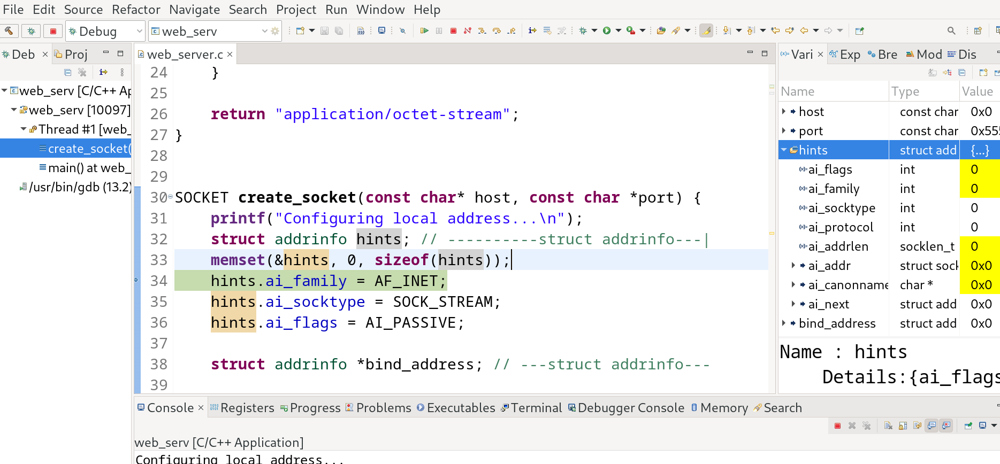

# Простой WEB Server на Си

Создаем серверный сокет 

Объявляем и инициализируем нашу структуру hints

Вызываем функцию __getaddrinfo(...)__ для преобразования доменного имени, имени хоста и IP-адреса из удобочитаеммого текстового представления в структурированный двоичный формат для сетевого API операционной системы

Создаем серверный сокет.

